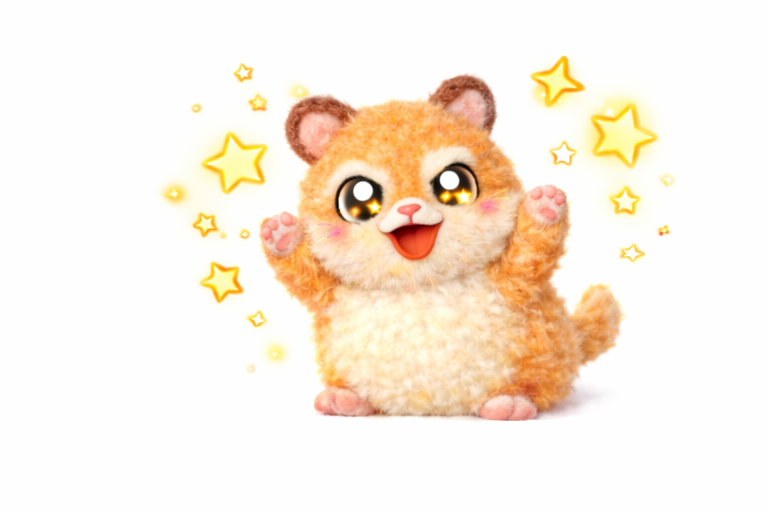

    
    

    
 
    <h2 style="border-bottom: 1px solid #21262d; color: #c9d1d9;"> An aspiring AI Engineer </h2>  
    
 I'm a junior AI developer focused on shipping real, user facing AI features.</li>I build LLM pipelines with LangChain/LangGraph, serve them via FastAPI + Docker on GCP, and standardize outputs with robust JSON schemas and streaming 
 
    

    

    <h2 style="border-bottom: 1px solid #21262d; color: #c9d1d9;"> 🛠️ Tech Stacks </h2>   
    
 
          
          
          
          
           
          
          
          
          
           
          

    

    

    <h2 style="border-bottom: 1px solid #21262d; color: #c9d1d9;"> 🧑‍💻 Contact me </h2>   
    
 
         
          
 
    

<!-- ZOOROFILE_START -->
<!-- Auto-generated by Zoorofile 🐾 | Do not edit manually -->
<!-- Last updated: 2026-07-24T01:42:24.047Z -->

---

💪 열심히 개발 중!

이번 주 4개의 레포지토리에 39개의 기여를 하고 있어요!

### 📅 이번 주 기여

**요약**

| | 레포 수 | 커밋 | PR | 이슈 |
|:---|:---:|:---:|:---:|:---:|
| 🔓 Public 레포 | 1개 | 1 | 0 | 0 |
| 🔒 Private 레포 | 3개 | 27 | 11 | 0 |

**🔓 Public 기여 상세**

- [wkdtpgus/wkdtpgus](https://github.com/wkdtpgus/wkdtpgus) — 1 commits

**💬 최근 커밋**

- `wkdtpgus` [Update README.md](https://github.com/wkdtpgus/wkdtpgus/commit/53b04bee37073167702d091efedb0c79301aba8a)

---

*🐾 Generated by [Zoorofile](https://github.com/YangHyeonBin/zoorofile) — Choose your git pet!*

<!-- ZOOROFILE_END -->

